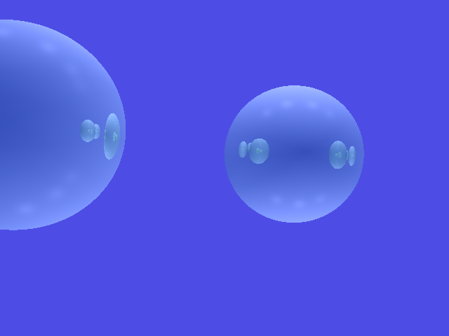
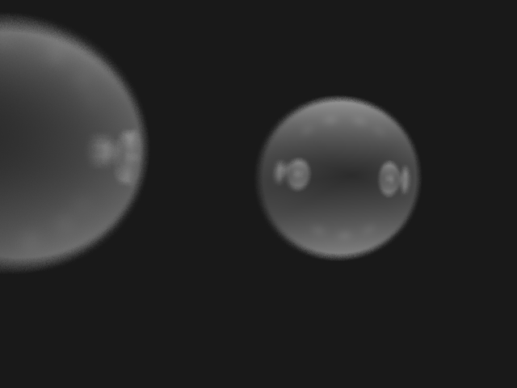
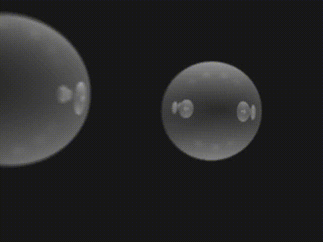

# Assignment 3 Report
This is a short report of what I've implemented in the second assignment as well as comments and explanations.

## System Info
- OS: macOs Big Sur 11.6
- Compiler: AppleClang 12.0.5.12050022

## Feild of View
`h = tan(FOV / 2) * f`

## Shadow Rays
I choose `epsilon = 1e-5`. Unfortunately, there are no obvious difference between with and without epsilon offset on my machine.

## Reflection
Reflection ray direction can be computed as `r = v-2n(n·v)`, and its origin also needs to offset by epsilon. Then recursivly call `shoot_ray` until `max_bounce` reach 0.

## Refraction
Refraction ray direction can be computed as `r = u * v + (u*c - sqrt(1 - u^2*(1-c^2))) * n`, where `u = n1/n2`, `c = -n·v`. To determine wether it is total internal reflection, first check if it is from lower wave speed medium to higher`(n1 > n2)`, and see if angle of incidence is greater than critical edge. `sin(θc) = n2/n1`. And again, recursivly call `shoot_ray` until `max_bounce` reach 0.

## Depth of Field
For each sensor pixel, I shoot 100 rays instead of 1, and average their ray color. The origin of the ray is randomly chose from `camera + {rx, ry, 0}`, where `rx` and `ry` is in range `[-0.15, 0.15]`. Larger range gives more **out of focus** effect.

## Animation
The gif I created is a serises of images that moving rightmost sphere to center and into focus. Then moving the sphere out of image.

## Screenshots
Original data:

 

Background color set to black and ambient set to gray:

Depth of view on:

More out of focus effect:

The gif, you can find the sequence of images in `img/sequence`

