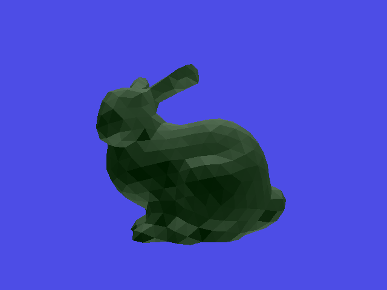
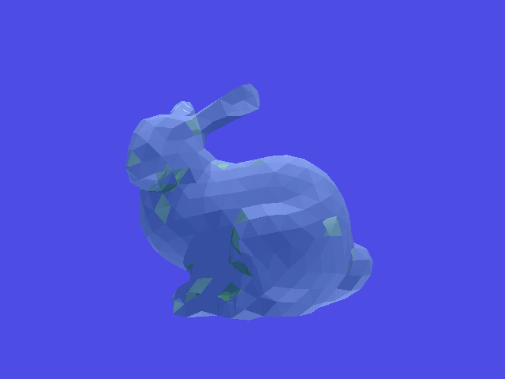
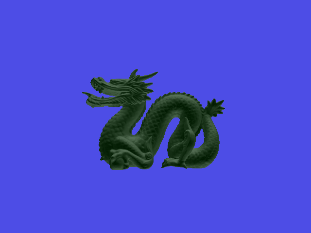
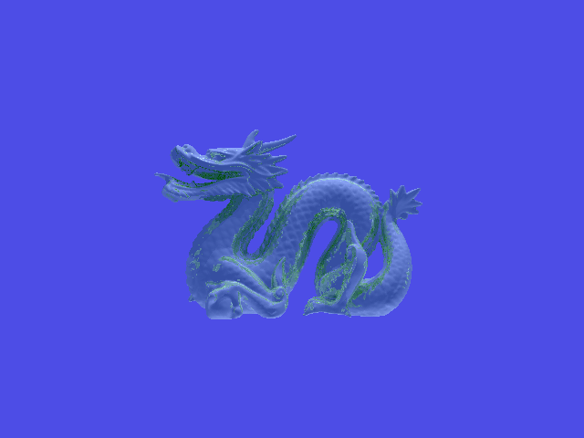

# Assignment 4 Report
This is a short report of what I've implemented in the second assignment as well as comments and explanations.

## System Info
- OS: macOs Big Sur 11.6
- Compiler: AppleClang 12.0.5.12050022

## Ray-Triangle Intersection
```
ray: p = e + td
triangle: a, b, c

u = b-a
v = c-a
A = [-u, -v, d]
r = a-e
x = [m, n, t]

Solve: Ax = r
Intersect if: 0<=m<=1, 0<=n<=1, m+n<=1, t>0
```

## Ray-Triangle Mesh Intersection
Traverse BVH tree, if the ray doesn't intersect current bounding box, we can prune the whole subtree. And save the cloesest intersection of triangle.

## Ray-Bounding Box Intersection
Me approach is to check the intersection of the ray and six surface of the box. Because the box is aligned to axis, it is very simple to do it.

## AABB Tree Construction
I used the top down method very similar to what proposed in README. First sort the triangles along an axis. And then split triangles by half and recursivly build left subtree from first half and right subtree from second half. Finally update bounding box from bottom to top.

## Screenshots
Original | With Reflection and Shaodws
:-------------------------:|:-------------------------:
 | 
 | 
