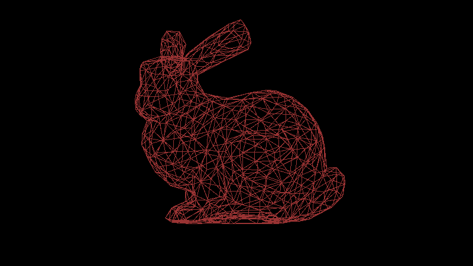
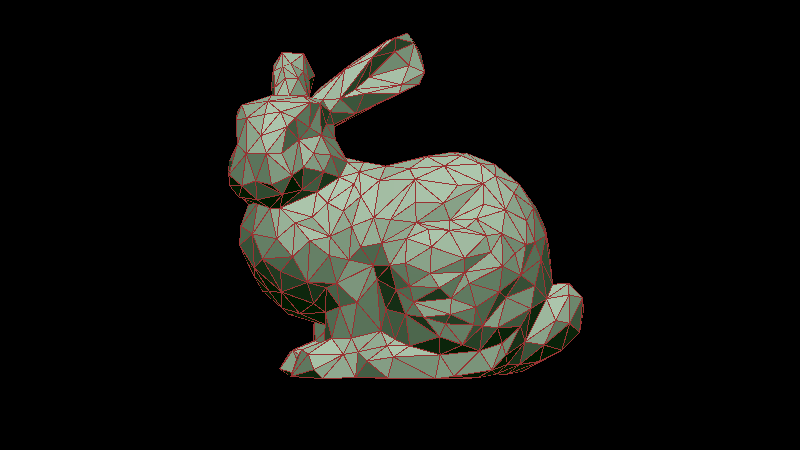
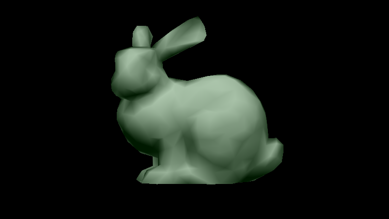
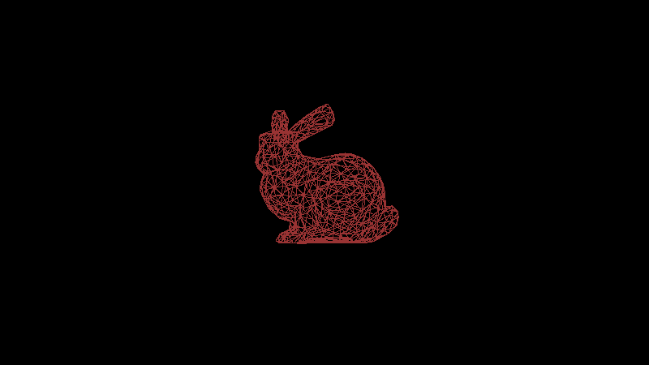
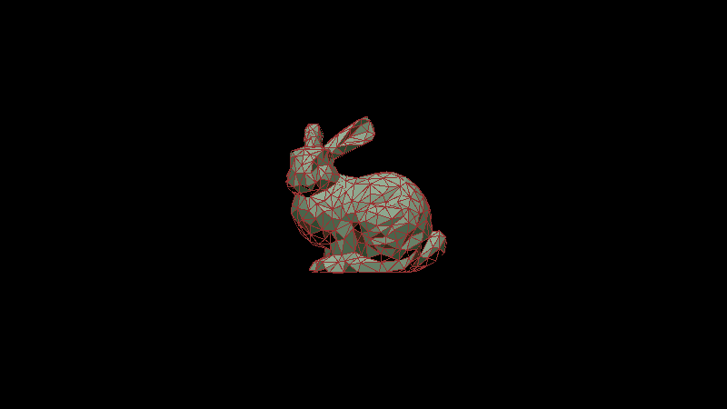

# Assignment 5 Report
This is a short report of what I've implemented in this assignment as well as comments and explanations.

## System Info
- OS: macOS Monterey 12.0.1
- Compiler: AppleClang 13.0.0.13000029

## Implementation Detail
In this section, I will explain the implementation detail of my program.

### Load Mesh
function `load_off` in `attributes.h` line 92, load vertices and facets to a `Mesh` object.

function `build_vas_triangles` in `attributes.h` line 111, build `std::vector` of vertex attributes from `Mesh` to pass to `rasterize_triangles`.

function `build_vas_lines` in `attributes.h` line 120, build `std::vector` of vertex attributes from `Mesh` to pass to `rasterize_lines`.

### Uniform Attributes
My uniform attributes save the following info
- ambient light
- material of the object
- single light source in the scene
- camera information
- matrix `M1`, from object space to camera space, including view and transformation
- matrix `M2`, from camera space to canonical space

Defined in `attributes.h` line 77

Initialized in `main.cpp` line 115

Calculation of matrix start from `main.cpp` line 135

function `camera_matrix` in `main.cpp` line 18, computation of camera space matrix

function `project_matrix` in `main.cpp` line 33, computation of canonical space matrix

### Vertex Attributes
My vertex attributes save the following info
- position
- normal
- color

Defined in `attributes.h` line 30.

function `interpolate` interpolate position and color.

### Fragment Attributes
My fragment attributes save the following info
- color
- depth

Defined in `attributes.h` line 57.

### FrameBuffer Attributes
My framebuffer attributes save the following info
- color
- depth, to determined whether current color is closer to the camera

Defined in `attributes.h` line 67.

### Shading
My program do shading in vertex shader, function `ray_trace` in `main.cpp` line 55.

The shading is done in camera space.

The normal of each vertex is calculated before rendering, function `per_face_normal` and `per_vertex_normal` in `attributes.h` line 132 and line 152.

The normals are stored in vertex attributes.

### Three Render Modes
You can change render mode in `main.cpp` line 74. As requested, three modes are supported: `wireframe`, `perface`(with wireframe), `pervertex`.

### Object Transformation and GIF
The parameters of translation and rotation are defined and initialized in `main.cpp` line 163.

The transformation matrix is updated in in `main.cpp` line 204.

`M_t1` move the barycenter of the mesh to origin.

`M_r1` rotate the mesh in x,y plane according.

`M_t2` move the mesh back and move towards camera (move along z-axis)

function `baricenter` in `attributes.h` line 195, calculate the barycenter of the mesh.

to enable GIF rendering, change `render_gif` to `true` in `main.cpp` line 75.

GIF file initializetion in `main.cpp` line 194, updated in line 232.

### Orthodox View
The "camera box" is computed by the bounding box of the mesh, `main.cpp` line 146.

function `bbox` in `attributes.h` line 181, compute the bounding box of the mesh after transformed to camera space.

### Perspective View
Perspective transform matrix is computed in function `project_matrix`, `main.cpp` line 33.

The "camera frustum" is defined in `main.cpp` line 140.

### Aspect Ratio
Framebuffer is defined in `main.cpp` line 78, you can change aspect ratio by changing its size.

To avoid distortion, the mesh are scaled according to the aspect ratio. `main.cpp` line 156.

## Screenshots
Wireframe | Per-face | Per-vertex
:-------------------------:|:-------------------------:|:-------------------------:
 |  | 
 |  | 
